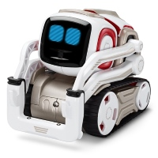

# Machine Learning for Autonomous Control of a Cozmo Robot. 

Anki's Cozmo robot has a built in camera and can be controlled using a python SDK, everything we need for autonomous driving.

We will use a convolutional neural network architecture developed by nVidia for their self driving car called PilotNet. More details are available in this [end-to-end deep learning for self-driving cars](https://devblogs.nvidia.com/deep-learning-self-driving-cars/) blog.

# Installing Keras

Install Miniconda
https://conda.io/miniconda.html

Install Cuda (using 9.0)
https://developer.nvidia.com/cuda-toolkit-archive
and CuDNN
https://docs.nvidia.com/deeplearning/sdk/cudnn-install/

conda install numpy scipy mkl-service libpython nose sklearn
conda install theano pygpu
conda install -c conda-forge opencv 
pip install pygame 
pip install cozmo[camera]

### TODO
mean absolute error
