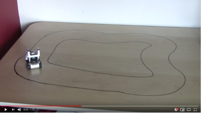

# Machine Learning for Autonomous Control of a Cozmo Robot. 

Anki's Cozmo robot has a built in camera and an extensive python SDK, everything we need for autonomous driving.

Youtube video of self driving Cozmo:

[](https://www.youtube.com/watch?v=1NHsIE3mchw "Cozmo autonomous driving")

This uses a convolutional neural network (CNN) architecture developed by nVidia for their self driving car called PilotNet. More details are available in this [end-to-end deep learning for self-driving cars](https://devblogs.nvidia.com/deep-learning-self-driving-cars/) blog. It is implemented using Keras with Theano back-end and is based on [this implementation](https://github.com/0bserver07/Nvidia-Autopilot-Keras). It was trained on an nVidia 1050Ti.


## Cozmo SDK
The [Cozmo SDK](http://cozmosdk.anki.com/docs/) allows us to control the robot using python from a PC. 

PC -- USB Cable -- Mobile Device running Cozmo App -- WiFi connection -- Robot

With this configuration we can get live images from the robot's camera to the PC and send steering commands back to the robot.

## Collecting Training Data

To train the network we require many images from the camera and the corresponding correct steering commands. The script [record.py](record.py) uses a joystick connected to the PC to control Cozmo. While you are driving the camera images and your steering inputs are recorded (saved in the data_train/ directory). Joystick button 1 is used to toggle recording on and off (Cozmo's LEDs turns red while recording). When the youtube video was recorded the model had been trained with 17,818 images.

## Training

[train.py](train.py) loads all of the recorded images and steering instructions in data_train/ and the network is trained on it for 25 epochs (25 passes through the data).

## Autonomous Driving

Once training is complete [drive.py](drive.py) loads the trained weights, passes images from the live camera feed through PilotNet to predict in realtime which direction to steer and sends the steering command to the robot.


# Installation

Install Miniconda (Python 3)
https://conda.io/miniconda.html

Install Cuda (using 9.0)
https://developer.nvidia.com/cuda-toolkit-archive
and CuDNN
https://docs.nvidia.com/deeplearning/sdk/cudnn-install/

Then:

```
conda install numpy scipy mkl-service libpython nose sklearn theano pygpu
conda install -c conda-forge opencv keras
pip install pygame 
```

Finally follow the [Cozmo SDK setup instructions](http://cozmosdk.anki.com/docs/initial.html) and ensure the SDK examples are working.

this will include `pip install cozmo[camera]`


